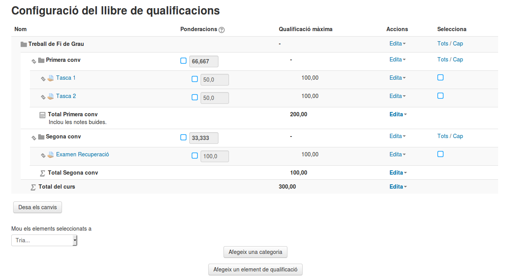
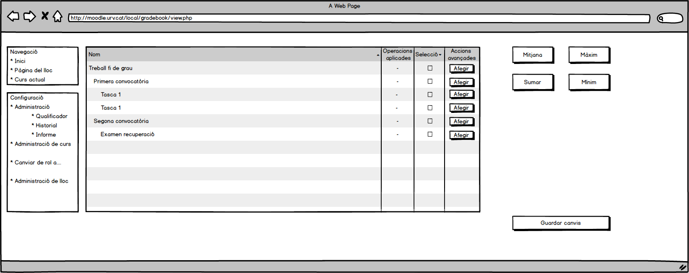
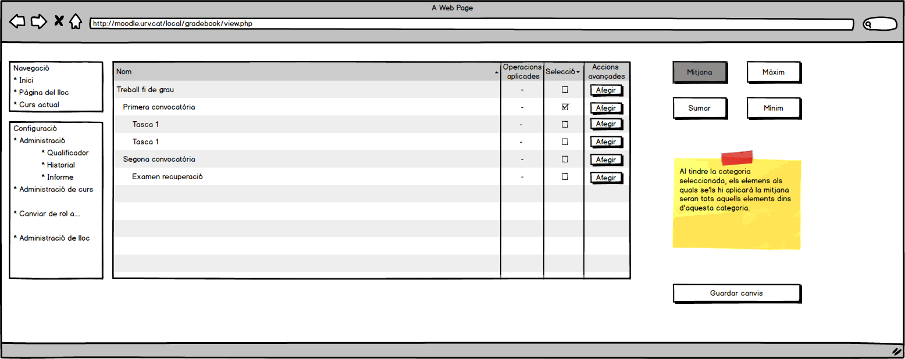
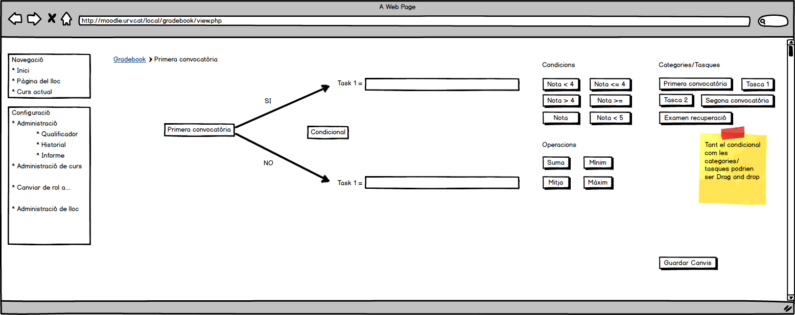
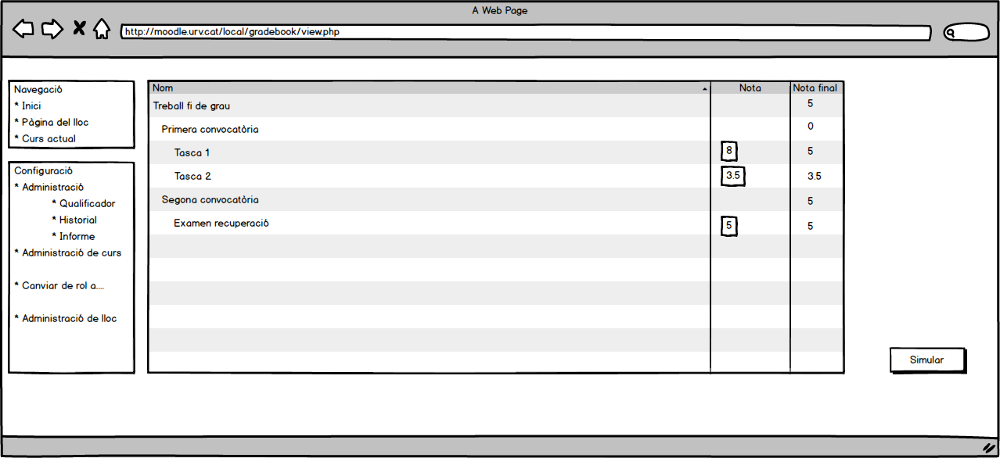

# Calc Gradebook

Desenvolupador: Daniel Tomé Fernàndez

Director: Jordi Pujol Ahulló

----

## Què veurem?

* Introducció
* Exemple d'ús amb Mockups
* Dubtes
* Suggerencies

----

## Introducció

Ens basem en els següents punts:

* Aquest plugin només és per crear fòrmules
* Estructura creada prèviament

---

## Introducció

Passos:

1. Creació d'estructura via moodle core
1. Afegir fòrmules via plugin
1. Simular les fòrmules via plugin

----

# Exemple d'ús

---

---

---

---

---

---

---

---

---

---

